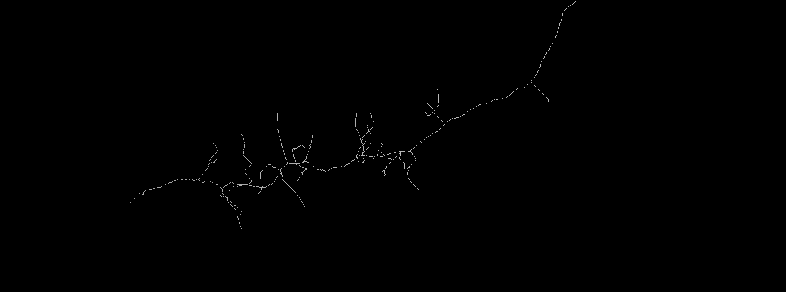
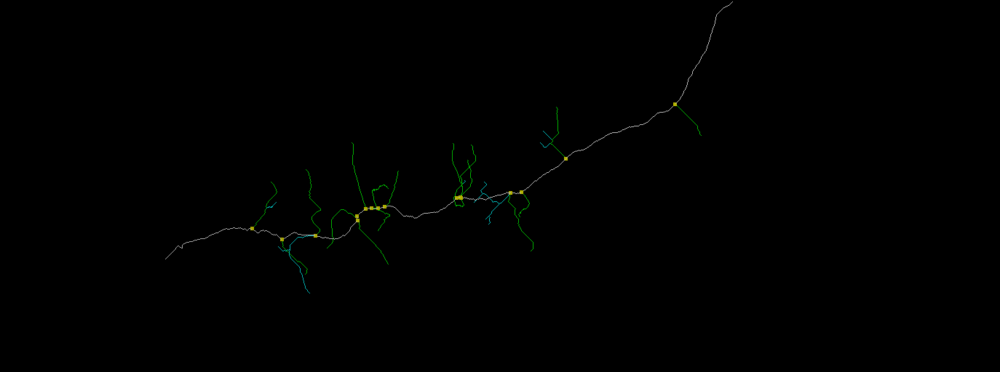
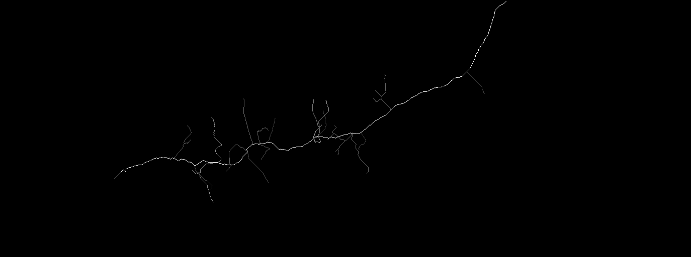

# Skeleton Pipeline

A complete pipeline for 3D image skeletonization and analysis.

## Demo

| Skeleton Extraction |
|:---:|
|  |

| Labeled Structure |
|:---:|
|  |

**Colors**: White=trunk, Yellow=branch points, Green=longest branch, Cyan=other branches

| Length Map |
|:---:|
|  |

**Values**: 255=trunk, 1-254=branch length (pixels), 0=background

---

## Quick Start

1. Clone the repository
```bash
git clone https://github.com/CharlieC30/Skeletonization.git
cd Skeletonization
```

2. Create conda environment and install dependencies
```bash
conda create -n skeleton python=3.9
conda activate skeleton
cd skeleton_python/skeleton_pipeline
pip install -r requirements.txt
```

3. Download sample data from [Google Drive](https://drive.google.com/drive/folders/1w4wIAczOLmvhfEuUUNyLAlcUoYi9cey5)
   - `example_input/` - place in `skeleton_python/DATA/`
   - `example_output/` - reference output (optional)

4. Run the pipeline
```bash
python run.py --input ../DATA/example_input/sample_input.tif
```

Output will be saved to `skeleton_python/output/YYYYMMDD_HHMMSS/`.

---

## Features

- Automatic 3D skeleton extraction from TIF images
- Main trunk and branch point detection
- Length analysis with labeled output
- Configurable parameters via YAML files

---

## Usage

### Basic usage
```bash
python run.py --input ../DATA/your_image.tif
```

### Use custom config
```bash
python run.py --input ../DATA/your_image.tif --config config/config_filopodia.yaml
```

### Show all options
```bash
python run.py --help
```

---

## Pipeline Steps

| Step | Name | Description |
|------|------|-------------|
| 1 | Format conversion | Normalize TIF and convert to uint8 |
| 2 | Otsu thresholding | Binarize using Otsu's method |
| 3 | Mask cleaning | Morphological operations |
| 4 | Skeletonization | Extract skeleton using Kimimaro |
| 5 | Length analysis | Analyze main trunk and branches |

---

## Output Structure

```
output/YYYYMMDD_HHMMSS/
├── config_used.yaml     # Config backup
├── 01_format/           # Normalized TIF
├── 02_otsu/             # Binary masks
├── 03_cleaned/          # Cleaned masks
├── 04_skeleton/         # SWC + skeleton TIF
└── 05_analysis/         # JSON + labeled TIF
```
